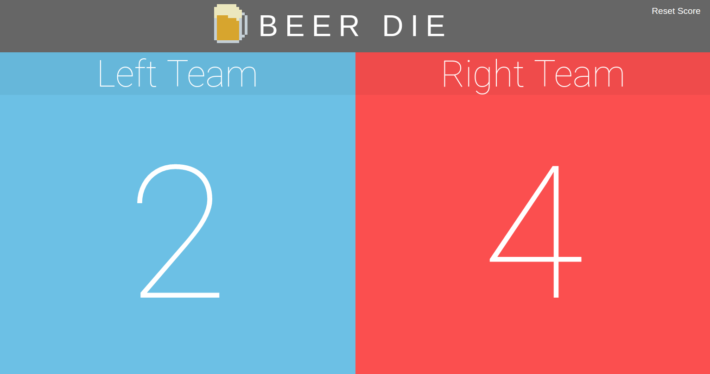

# aws-iot-score-tracker
aws-iot-score-tracker functions as a basic interface for wireless score tracking. It's specific use case in this application is tweaked for the game [beer die](https://en.wikipedia.org/wiki/Beer_die), however, it can be generalized to any team vs team game (ping pong, air hockey, etc.). A React.js UI maintains a score that is updated through the use of one or multiple [AWS IoT Buttons](https://aws.amazon.com/iotbutton/).

When an AWS IoT button is clicked, the signal is sent to its registered AWS IoT topic which is received by this Node.js server through the `aws-iot-device-sdk`. The signal is then forwarded to the client through a socket connection. Finally, the client parses the message forwarded from the server and updates the UI accordingly.

